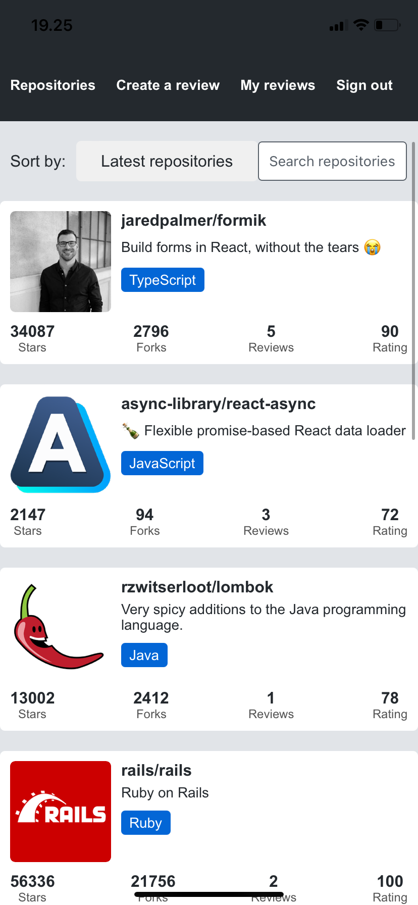
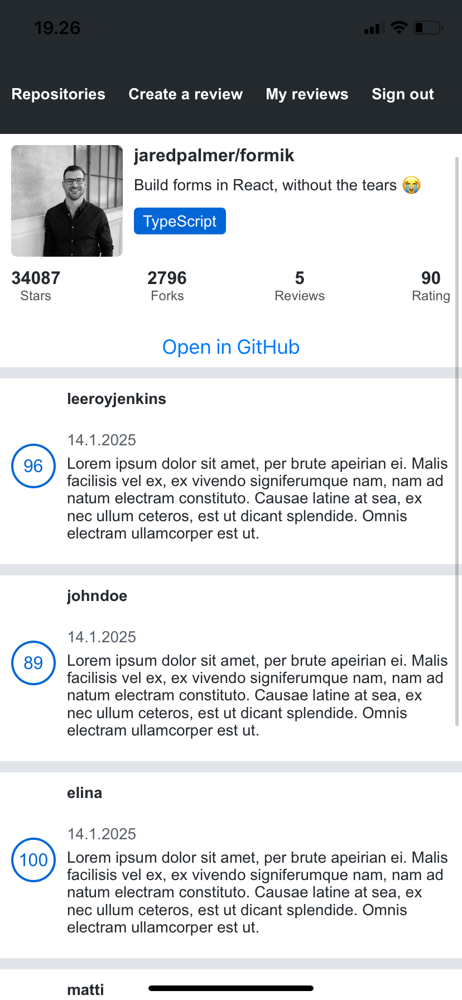
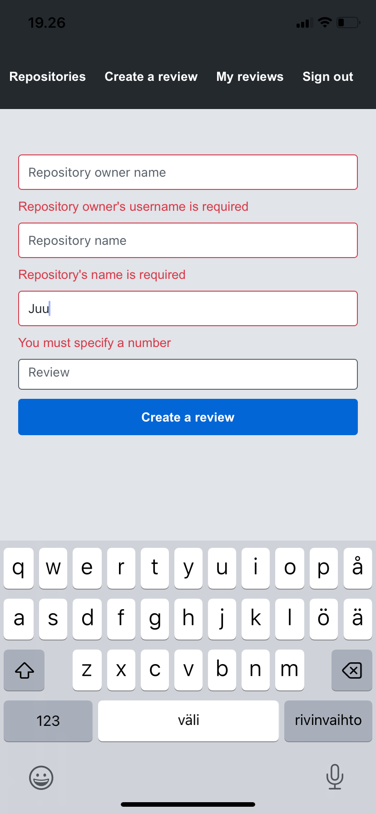
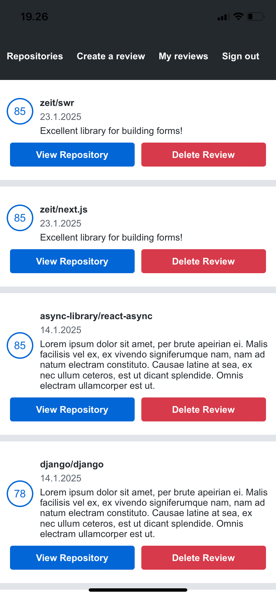

Full Stack Open kurssilla tehty React Native sovellus, toteutettu Expolla.

Sovelluksessa voi kirjautua ja arvostella GitHub Repositoryja, seka tarkastella/poistaa antamiaan arvosteluja.

Käytetyt tekniikat ja teknologiat:

- React Native ja Expo
- ESLint
- React DevTools
- React Native Core Components
- Styling and theming
- Flexbox for layout
- Routing
- Form state management (Formik)
- Form validation (Yup)
- Platform-specific code
- Communatiing with server (HTTP, GraphQL and Apollo)
- Environment variables
- Async-storage
- React Context
- Testing React Native applications
- Linking APi (https://docs.expo.dev/versions/latest/sdk/linking/)
- React Native Picker
- Infinite scrolling

