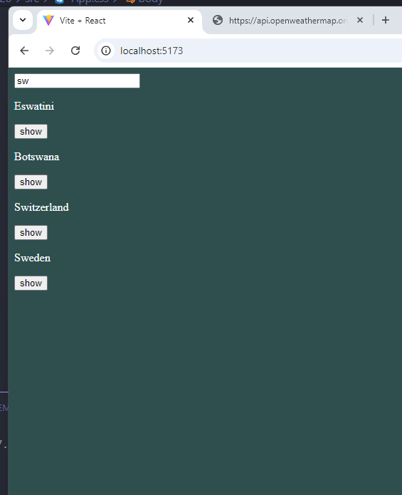
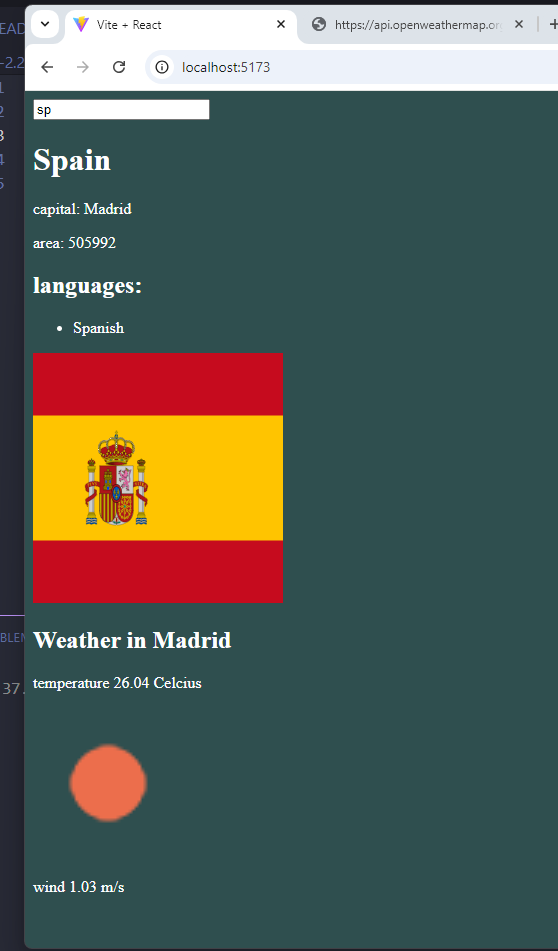

# React + Vite

Osoitteesta https://studies.cs.helsinki.fi/restcountries/ löytyy palvelu, joka tarjoaa paljon eri maihin liittyvää tietoa. Tein sovelluksen, jonka avulla voit tarkastella eri maiden tietoja.

Sovelluksen käyttöliittymä on yksinkertainen. Näytettävä maa haetaan kirjoittamalla hakuehto hakukenttään.
Jos ehdon täyttäviä maita on liikaa (yli kymmenen), kehotetaan tarkentamaan hakuehtoa:
Jos maita on kymmenen tai alle mutta enemmän kuin yksi, näytetään hakuehdon täyttävät maat.
Kun ehdon täyttäviä maita on enää yksi, näytetään maan perustiedot, lippu sekä maassa puhutut kielet.
Kun sivulla näkyy useiden maiden nimiä, tulee maan nimen viereen nappi, jota klikkaamalla pääsee suoraan maan näkymään.
Yksittäisen maan näkymässä näkyy pääkaupungin säätiedotus. Toiminnon toteutukseen käytin https://openweathermap.org/:ia.

