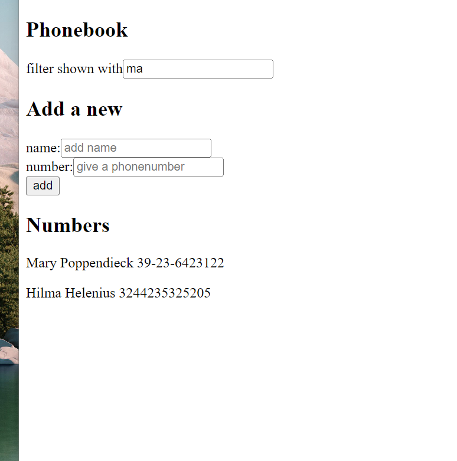
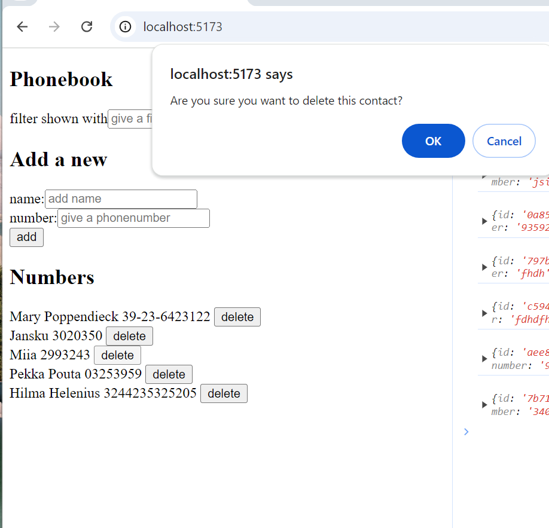
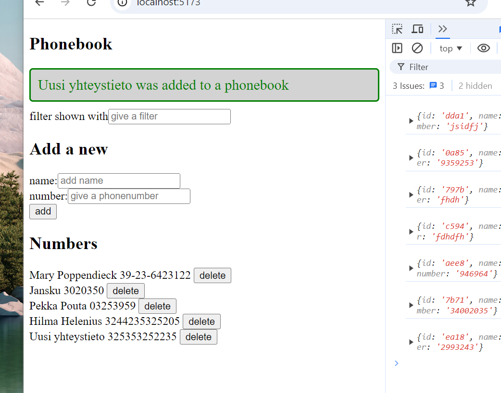
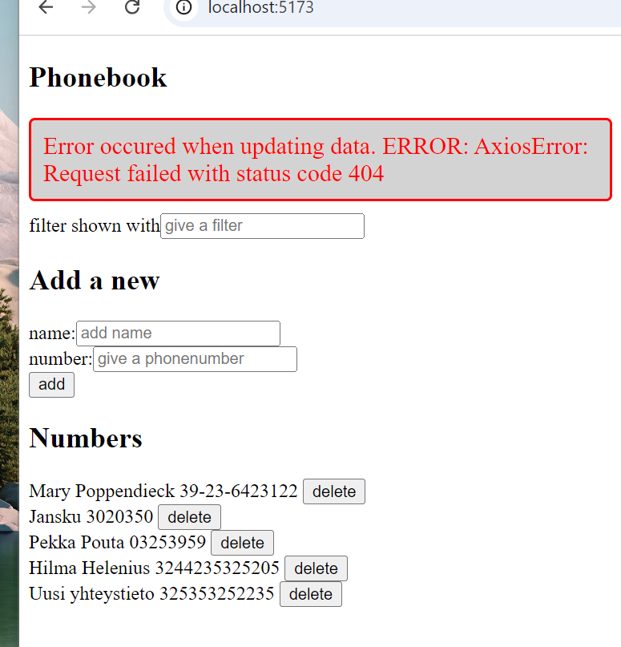

# React + Vite

Puhelinluettelo ohjelma.

Yhteystiedot säilötään palvelimelle ja niiden muutokset synkronoidaan myös palvelimelle. Yhteystietoja voi lisätä, muokata sekä poistaa. Muokkauksien ja poistojen suorittaminen varmistetaan käyttäjältä. Onnistuneesta synkronoinnista palvelimen kanssa tulee käyttäjälle ilmoitus, joka katoaa 5 sekunnin kuluessa. Virheenhallinta on myös hoidettu, ja jos palvelimen kanssa kommunikointi tuottaa errorin, tulee siitä ilmoitus käyttäjälle. Myös kyseinen ilmoitus katoaa 5 sekunnin kuluessa. Yhteystietoja voidaan filteröidä input kentän avulla, haetaan henkilöitä joiden nimi sisältää input kentän syötteen.

