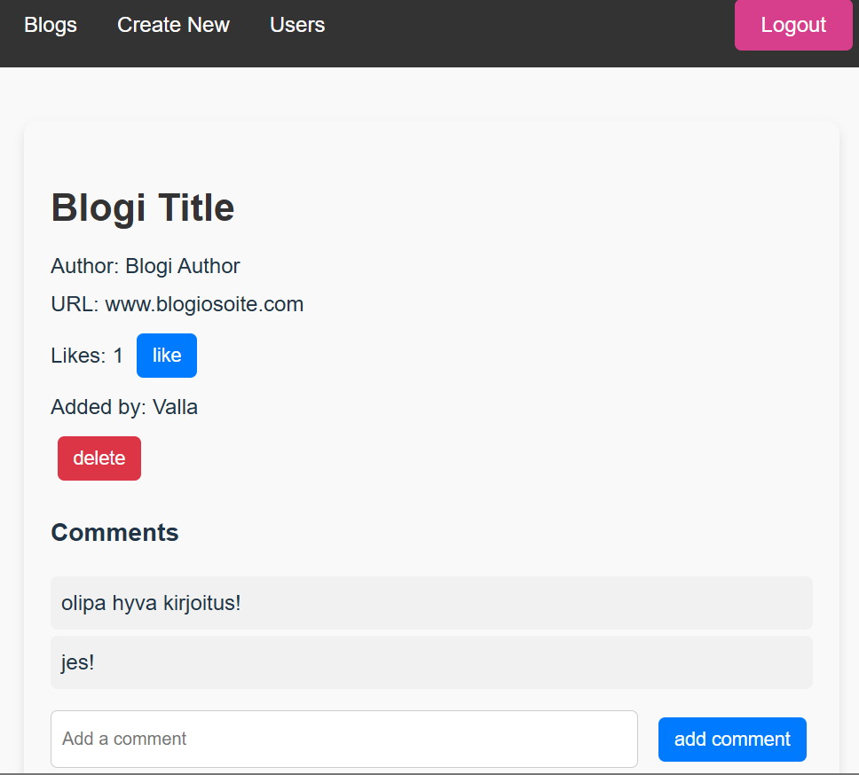

# React + Vite

Blogilista sovellus:

- Sovellukseen tulee kirjautua. Kirjautunut käyttäjä näkee kaikki käyttäjien lisäämät blogit. Käyttäjä voi kommentoida lisättyjä blogeja sekä antaa niille tykkäyksiä. Käyttäjä voi myös lisätä blogeja sekä poistaa itse lisäämiään blogeja. Muiden lisäämiä blogeja ei voi poistaa.
- Tyylittely toteutettu styled-components-kirjaston avulla
- Tilan hallinta toteutettu useState-hookia, React Queryä, useReducer-hookia ja Contextia käyttäen
- Backendin olen tehnyt itse, se löytyy kansiosta 4 (Node & express)

Voit kokeilla sovellusta kopioimalla repot, aja sekä backendissa että frontendissa npm install. Käynnistä backend komennolla npm start ja frontend npm run dev. Voit kirjautua sovellukseen testikäyttäjällä: Käyttäjänimi Valla ja salasana Valla

ReadMe ja lisää kuvia projektista (Osa 7 / 7.9-7.21 kansio):
https://github.com/janikasavela/FullstackPalautusRepo/tree/main/Osa%207/7.9-7.21

