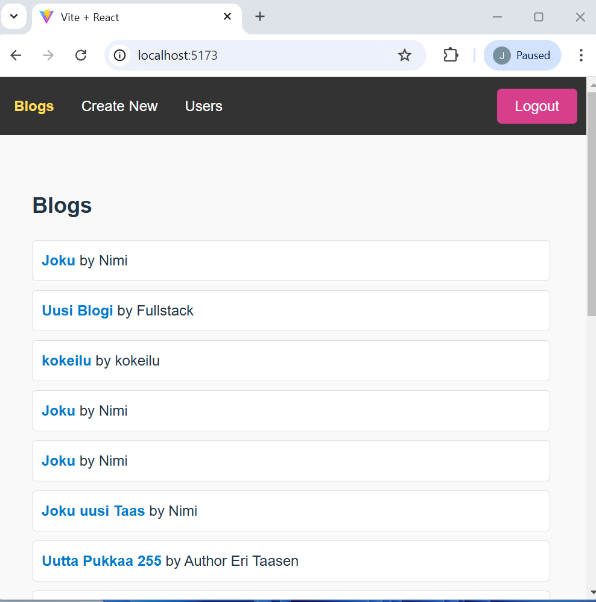
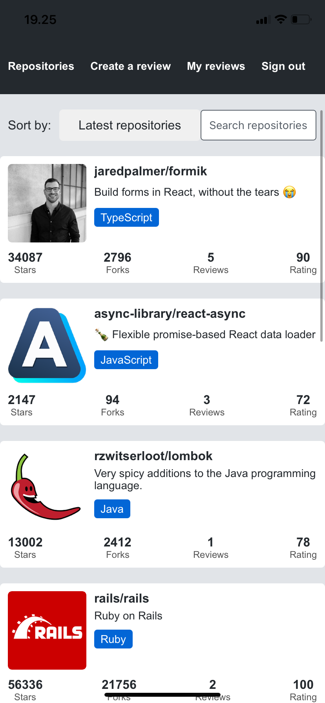
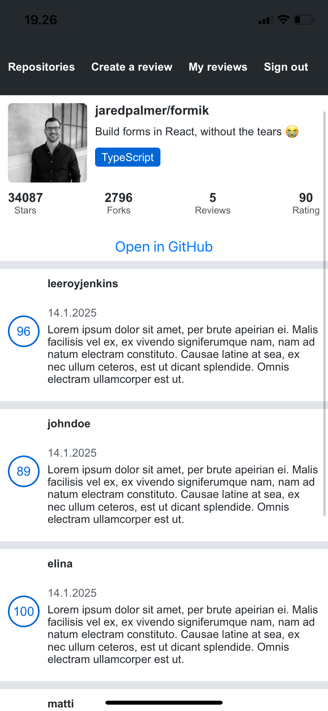
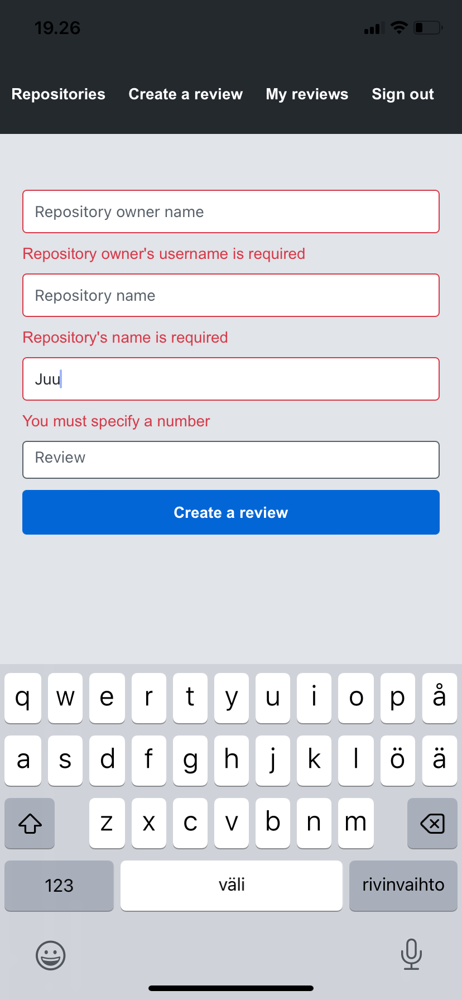
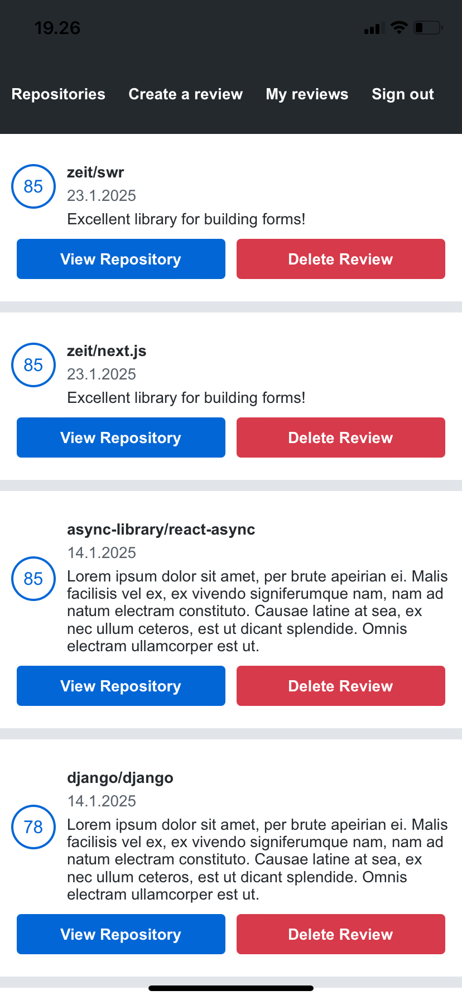

# Käymäni avoimen yliopiston Fullstack Open kurssin tehtävien palautuksia

Kurssilla tutustutaan JavaScriptilla tapahtuvaan moderniin websovelluskehitykseen ja otetaan haltuun React, Redux, Node.js, MongoDB, GraphQL ja TypeScript. Pääpaino on React-kirjaston avulla toteutettavissa single page -sovelluksissa, ja niitä tukevissa Node.js:llä toteutetuissa REST-rajapinnoissa.

OSA 1:

- Reactin perusteet

OSA 2:

Frontendissä:

- Palvelimen kanssa kommunikointi
- Moduulit
- Lomakkeiden käsittely

Pienet esittelytekstit ja kuvat lisätty näihin:

- 2.6-2.15 (Phonebook) (Julkaistu Fly.io:n kautta osoitteessa https://express-wispy-wind-7618.fly.dev/)
- 2.16-2.20 (Eri maiden tietojen hakua ja niiden säätiedot kahden eri REST API:n avulla)

OSA 3:

Backendissä:

- Node.js ja Express
- Sovellus internetiin
- Tietojen tallentaminen MongoDB-tietokantaan
- Validointi ja ESlint

Oma repo tälle: https://github.com/janikasavela/Fullstack-kurssin-Backend

Avoimen yliopiston Fullstack Open kurssilla tehty backend Node express-teknologialla toteutettuna. Frontend on React + Vite. Tietokantana toimii MongoDB.

Julkaistu sovellus: https://express-wispy-wind-7618.fly.dev/

Requests: GET https://express-wispy-wind-7618.fly.dev/api/persons DELETE https://express-wispy-wind-7618.fly.dev/api/persons/:id POST https://express-wispy-wind-7618.fly.dev/api/persons Content-Type: application/json

{ "name": "new name", "number": "040-1234556" }

OSA 4:

Node express ympäristöön:

- Backendin yksikkö- ja integraatiotestaus
- Backendin logiikka käyttäjienhallintaan ja kirjautumiseen
- Token-perustainen kirjautuminen

OSA 5:

- Kirjautuminen frontendissä
- React-sovellusten testaaminen
- props.children ja proptypet

OSA 6:

- Flux-arkkitehtuuri ja Redux
- Redux-sovelluksen kommunikointi palvelimen kanssa
- React Query, useReducer ja context

OSA 7:

- React Router
- custom-hookit
- Lisää tyyleistä
- Webpack
- Luokkakomponentit, Sekalaista web kehityksestä

Laajensin osan 5 blogilista sovellusta:

- Tyylittely toteutettu styled-components-kirjaston avulla
- Tilan hallinta toteutettu React Queryä, useReducer-hookia ja Contextia käyttäen
- Lisätty näkymä mm käyttäjille
- Navigaatiomenu
- Blogien kommentointi lisätty
- Backendiin lisätty toiminnalisuudet kommentointiin

ReadMe ja lisää kuvia projektista (Osa 7 / 7.9-7.21 kansio):
https://github.com/janikasavela/FullstackPalautusRepo/tree/main/Osa%207/7.9-7.21

OSA 8:

- GraphQL-palvelin
- React ja GraphQL
- Tietokanta ja käyttäjien hallinta (MongoDB)
- Kirjautuminen ja välimuistin päivitys
- Fragmentit ja subskriptiot

OSA 9:

- TypeScript basics
- Typing an Express app
- React with types

Toteutin osiossa myös projektin johon sekä frontendin että backendin jotka löytyvät osion kansiosta 9.8-9.14&9.20-9.30. Kyseisen sovelluksen tarkoituksena on hallita potilastietoja ja lääketieteellisiä merkintöjä. Frontend on rakennettu Reactilla, ja siinä käyttäjät voivat tarkastella potilastietoja, kuten nimi, sukupuoli, ammatti ja sairaushistoria. Lisäksi käyttäjät voivat lisätä uusia lääketieteellisiä merkintöjä, kuten terveystarkastuksia, sairaalahoitoja tai työterveyshuoltoa, ja liittää niihin diagnoosikoodeja. Backend, joka on rakennettu Node.js ja express teknologialla käyttää tietokantaa, käsittelee potilastietojen tallentamisen ja hakemisen. Sovelluksen avulla terveydenhuollon ammattilaiset voivat seurata potilaidensa hoitohistoriaa ja lisätä uusia merkintöjä.

OSA 10:
Aiheena React Native, jolla toteutettiin puhelinsovellus, käyttäen Expoa.

Sovelluksessa voi kirjautua ja arvostella GitHub Repositoryja, seka tarkastella/poistaa antamiaan arvosteluja.

Käytetyt tekniikat ja teknologiat:

- React Native ja Expo
- ESLint
- React DevTools
- React Native Core Components
- Styling and theming
- Flexbox for layout
- Routing
- Form state management (Formik)
- Form validation (Yup)
- Platform-specific code
- Communatiing with server (HTTP, GraphQL and Apollo)
- Environment variables
- Async-storage
- React Context
- Testing React Native applications
- Linking APi (https://docs.expo.dev/versions/latest/sdk/linking/)
- React Native Picker
- Infinite scrolling

OSA 12:

Aiheena kontit, tarkemmin ottaen Docker. Harjoituksissa mm. käytetään säilöjä luomaan muuttumattomia suoritysympäristöjä Node.js- ja React-projekteille sekä tutkitaan ja kokeillaan monia erilaisia ja suosittuja työkaluja konttien käytössä.
